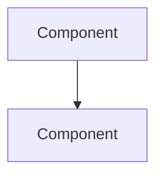

# knowledge-weapon

Companion skill to `library-weapon` for authoring **narrative knowledge documentation** — the technically deep, human-readable domain docs that explain HOW the system works, WHY it was designed that way, and WHAT the operational details are.

> **Scope boundary:** `library-weapon` owns PRDs, IRDs, and the documentation lifecycle. `knowledge-weapon` owns everything under `library/knowledge/private/<domain>/`. Neither touches the other's territory.
>
> **Agent entry point:** [`knowledge-guardian.md`](../../agents/knowledge-guardian.md)

---

## What This Skill Produces

Docs like:
- `library/knowledge/private/ai/resolver-overview.md` — narrative explanation of the Resolver service
- `library/knowledge/private/data/postgres-schema.md` — full SQL DDL with explanations
- `library/knowledge/private/auth/auth-architecture.md` — sequence diagrams + enforcement layers
- `library/knowledge/private/security/trust-boundaries.md` — trust boundary diagram + analysis
- `library/knowledge/private/standards/coding-standards-typescript.md` — canonical coding rules

Reference quality: match the depth of `legion-wiki/legion-secure/library/knowledge/private/`.

---

## Source Material (Always Read First)

| Source | What you extract |
|---|---|
| `library/knowledge/private/architecture/ADR-*.md` | The **WHY** — locked decisions, constraints, alternatives rejected |
| `library/requirements/backlog/prd-*/` | The **WHAT and HOW** — SQL DDL, API specs, file lists, technical considerations |
| Existing source code | Ground-truth for file paths, function names, type definitions |
| `library/knowledge/private/roadmap/PLAN.md` | Phase boundaries, feature relationships |

**Reading order:** ADRs first (understand decisions), then PRDs by domain (extract implementation details), then organize by topic domain (not by phase).

---

## The Document Format

Every knowledge doc follows this exact template:

```markdown
# Document Title

> Category: <Domain> | Version: 1.0 | Date: <Month YYYY> | Status: Active

One-sentence description of who should read this and what it covers.

**Related:**
- [`sibling-doc.md`](sibling-doc.md)
- [`../architecture/ADR-NNN-slug.md`](../architecture/ADR-NNN-slug.md)

---

## Section 1

[Narrative prose, progressive disclosure. Open with "why this exists."]



## Section 2

[SQL DDL, TypeScript code, config samples — ground-truth technical content]

```sql
CREATE TABLE example ( ... );
```
```

**Rules:**
- Header category matches the domain folder name (capitalized)
- Related section links to sibling docs and the ADRs the doc implements
- Body: progressive disclosure — "why this exists" first, then deep detail
- Use Mermaid for all diagrams; never explicit colors
- Prose is narrative, not bullet soup
- 100-400 lines per doc; split if longer

See `guides/02-document-format.md` for the full spec.

---

## Domain Taxonomy (15 Standard Domains)

The canonical domain folders for a full-stack SaaS/IDE product. Adapt as needed per repo.

| Domain folder | What belongs here |
|---|---|
| `architecture/` | Narrative docs alongside ADRs: `system-overview.md`, `request-lifecycle.md`, plane/module explanations |
| `ai/` | LLM integration: resolver, prompt cascade, RAG pipeline, model routing, coach system, observability |
| `auth/` | Auth provider, session model, JWT lifecycle, RBAC, role definitions |
| `container/` | Runtime, hibernation, PTY bridge, file sync, preview proxy, egress rules |
| `curriculum/` | Education hierarchy, module/class/semester/degree system, gamification, Journey Tools |
| `data/` | Postgres schema (full DDL), Valkey key catalog, vector DB collections, object storage layout, audit retention |
| `frontend/` | Shell layout, widget framework, chat stream, mobile PWA |
| `infrastructure/` | Worker fleet, control plane, deployment pipeline, observability |
| `monetization/` | Billing model, subscription tiers, token metering, Stripe Connect |
| `multi-tenant/` | Tenant model, provisioning runner, marketplace, RLS policies |
| `security/` | Trust boundaries, data classification, egress model, prompt injection defenses |
| `standards/` | TypeScript conventions, API design, error handling, Git conventions |
| `collaboration/` | Coach attach, live sessions, recordings |
| `plugins/` | Plugin API surface, individual plugin docs |
| `operations/` | Capacity planning, incident severity, SLA, on-call runbooks |

See `guides/01-domain-taxonomy.md` for full detail on each domain.

---

## Analysis Workflow

```
1. SURVEY — list all ADRs and group them by domain
2. PLAN — map each domain folder to its target docs
3. DRAFT BATCH A — overview.md + architecture narratives (these set the stage for all other docs)
4. DRAFT BATCHES B-E — remaining domains in parallel (they don't block each other after A)
5. CROSS-LINK — verify every doc's Related section links correctly
6. PUBLISH — confirm every doc has the standard header and is in the right path
```

See `guides/03-analysis-workflow.md` for the step-by-step process.

---

## Companion Resources

| File | Contents |
|---|---|
| `guides/01-domain-taxonomy.md` | What belongs in each domain folder, examples per domain |
| `guides/02-document-format.md` | Full document format spec with annotated example |
| `guides/03-analysis-workflow.md` | Step-by-step workflow for producing a full knowledge base from scratch |
| `templates/knowledge-doc-template.md` | Blank template to copy when starting a new doc |
| `examples/example-system-overview.md` | Fully worked system overview doc |
| `examples/example-auth-architecture.md` | Fully worked auth architecture doc with sequence diagram |
