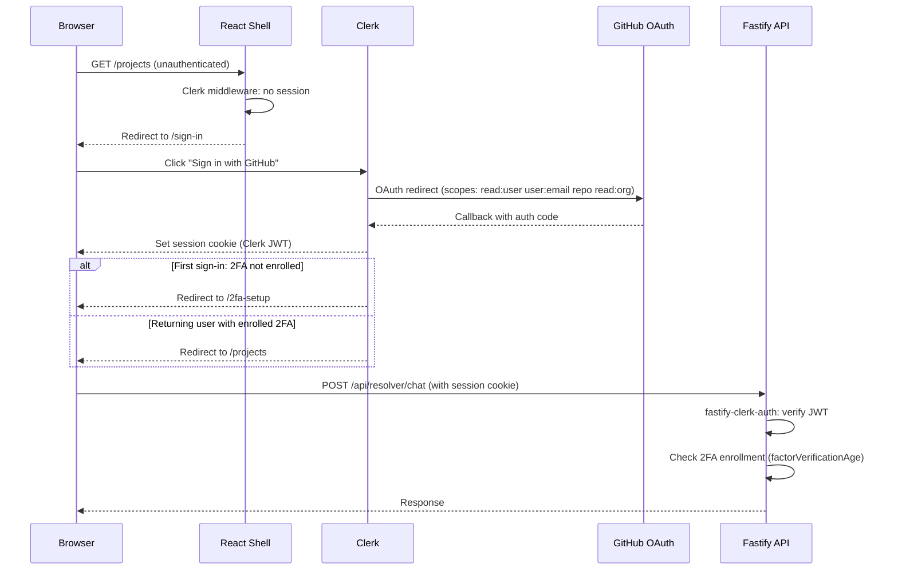

# Example: Auth Architecture Doc (Abbreviated)

This shows how to write an auth architecture doc — the most common domain-level doc pattern. Source: `legion-code/library/knowledge/private/auth/auth-architecture.md`.

Key patterns demonstrated:
- Sequence diagram as a first-class section
- Two enforcement layers explained separately
- Specific claims cited ("GitHub OAuth only, no email/password")
- ADR cross-referenced to explain WHY

---

```markdown
# Auth Architecture

> Category: Auth | Version: 1.0 | Date: May 2026 | Status: Active

Legion Code's authentication architecture — Clerk + GitHub OAuth only, mandatory 2FA, and two-layer enforcement.

**Related:**
- [`session-model.md`](session-model.md)
- [`tenant-roles.md`](tenant-roles.md)
- [`rbac.md`](rbac.md)
- [`../architecture/ADR-005-auth-github-oauth-mandatory.md`](../architecture/ADR-005-auth-github-oauth-mandatory.md)

---

## Provider: Clerk

Clerk handles all authentication:
- GitHub OAuth (the **only** sign-in method — no email/password, no other OAuth providers)
- 2FA enrollment (passkey preferred, TOTP fallback) — **mandatory** before any page renders
- JWT session management (60s JWTs, auto-refreshed by Clerk JS SDK)
- User creation on first sign-in

**Why GitHub OAuth only:** Every learner needs a GitHub account to do meaningful work — every project needs a real repo. Requiring GitHub at sign-in means the `repo` OAuth scope is available from the first session without a second consent step. See [ADR-005](../architecture/ADR-005-auth-github-oauth-mandatory.md).

---

## Auth flow



---

## Two enforcement layers

**Layer 1 — Fastify preHandler plugin (`fastify-clerk-auth`):**
- Verifies Clerk JWT on every API request
- Returns `401` for missing or invalid JWTs
- Returns `403 { error: "2fa_required" }` if 2FA is not enrolled or the 8h window has expired

**Layer 2 — React shell middleware:**
- Clerk client-side session hooks check authentication on every navigation
- Intercepts `403 2fa_required` and redirects to `/2fa-setup`

A bug in the React layer does not expose data — the Fastify API rejects unauthenticated requests independently.

---

## GitHub OAuth scopes

| Scope | Why |
|---|---|
| `read:user` | Basic profile: name, username, avatar |
| `user:email` | Email address |
| `repo` | Create and push to repos (required for project creation) |
| `read:org` | Future: community-scoped instructor associations |
```

---

## What makes this a good auth doc

1. **Opens with the provider choice** — not with how auth works in general, but specifically what was chosen and why
2. **"Why GitHub OAuth only"** block — explains the ADR decision in plain English without requiring the reader to open the ADR
3. **Sequence diagram** covers the full flow from browser open to API call — not just the OAuth handshake
4. **Two enforcement layers** are separate, clearly named, and explain the defense-in-depth rationale
5. **Scopes table** — the reader knows exactly what they authorized and why each scope is needed
6. **Specific `403 { error: "2fa_required" }` error code** — not generic "2FA is enforced" but the exact error shape
