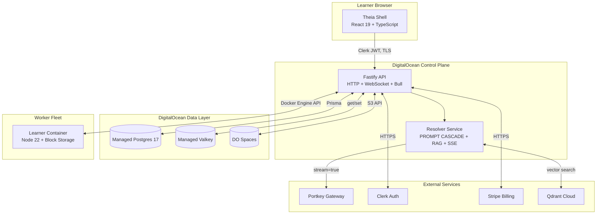

# Example: System Overview (Abbreviated)

This is an abbreviated example of a `library/knowledge/private/architecture/system-overview.md`. It shows the exact format, section structure, and Mermaid diagram style.

The full version for `legion-code` lives at:
`legion-code/library/knowledge/private/architecture/system-overview.md`

---

```markdown
# System Overview

> Category: Architecture | Version: 1.0 | Date: May 2026 | Status: Active

Master architecture diagram and component summary for the Vibe by Legion Code platform.

**Related:**
- [`request-lifecycle.md`](request-lifecycle.md)
- [`resolver-placement.md`](resolver-placement.md)
- [`../ai/resolver-overview.md`](../ai/resolver-overview.md)
- [`ADR-001-stack-theia-react-reactflow.md`](ADR-001-stack-theia-react-reactflow.md)
- [`ADR-002-llm-gateway-resolver-portkey.md`](ADR-002-llm-gateway-resolver-portkey.md)

---

## Architecture diagram



---

## Component summary

### Theia shell (browser)

The learner's primary surface. Built on Theia as a library (not forked) per [ADR-013](ADR-013-theia-as-library.md). [...]

### Fastify API (control plane)

A single Fastify process on a DigitalOcean Droplet. Handles all HTTP routes, WebSocket endpoints, Bull background jobs, and webhook handlers. [...]

### Resolver service

The most security-critical component. Assembles the 5-layer prompt cascade, runs RAG retrieval, and proxies to Portkey. Skill content never reaches the client. [...]

---

## Key design decisions

| Decision | Choice | ADR |
|---|---|---|
| IDE framework | Theia as library + React 19 | [ADR-001](ADR-001-stack-theia-react-reactflow.md) |
| LLM gateway | Resolver + Portkey | [ADR-002](ADR-002-llm-gateway-resolver-portkey.md) |
| Storage | Postgres + Valkey + Qdrant + DO Spaces | [ADR-003](ADR-003-storage-postgres-valkey-qdrant-spaces.md) |
| Container runtime | Docker + three-tier hibernation | [ADR-004](ADR-004-dev-container-runtime-docker-hibernating.md) |
```

---

## What makes this a good system overview

1. **Architecture diagram is the first thing** — not buried below prose
2. **Diagram uses subgraphs** to show logical groupings (Browser, Control Plane, Data Layer, etc.)
3. **No explicit colors** in the Mermaid diagram (breaks dark mode)
4. **Component summary table** at the end cross-references each component to its detailed doc
5. **Key design decisions table** links every major choice to its ADR
6. **Related section** links to the two companion docs readers typically need next
7. **Concise prose** — the component summaries are 1-3 sentences each, not paragraphs
