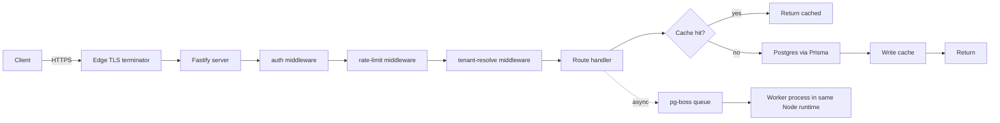

# Request Lifecycle

> Category: Architecture | Version: 1.0 | Date: May 2026 | Status: Active

How an HTTP request flows through ExampleApp from the edge to the database and back, with every intermediate layer named. Read this first if you're debugging an end-to-end issue or onboarding onto the backend.

**Related:**
- [authentication-flow.md](authentication-flow.md)
- `api/src/index.ts` (bootstrap)
- `api/src/middleware/` (all middleware)

---

## Overview

ExampleApp's backend is a single Fastify server that fronts a Postgres DB (via Prisma) and a Redis cache. Requests pass through a fixed middleware chain, hit a route handler, optionally touch the cache and DB, and return. Asynchronous work (emails, long jobs) is offloaded to a `pg-boss` worker in the same process.

## Architecture

## Middleware chain

The order is fixed and must not be reshuffled without reviewing every handler for assumptions.

1. **CORS** — `api/src/middleware/cors.ts`. Allows configured origins only; reflects `Authorization` header.
2. **Body parser** — built into Fastify; limited to 1 MB by default.
3. **Request-ID** — `api/src/middleware/request-id.ts`. Generates a UUID per request, echoed back as `X-Request-ID` and attached to every log line.
4. **Auth** — `api/src/middleware/auth.ts`. Validates the bearer token, attaches `request.user`. Public routes are skipped by explicit allowlist.
5. **Rate limit** — `api/src/middleware/rate-limit.ts`. Token-bucket keyed on `user.id` for authed requests, IP for anonymous. Buckets live in Redis.
6. **Tenant resolve** — `api/src/middleware/tenant.ts`. Extracts the tenant from `request.host` and loads `tenant` onto the request. Only runs for multi-tenant routes.
7. **Route handler** — the thing you actually want to read.

## Cache strategy

- **Read path:** handler calls a typed accessor like `getUserById(id)` which first checks Redis (`user:<id>`), falls through to Postgres on miss, writes through on return.
- **Write path:** mutating endpoints call `invalidateUser(id)` after the DB write. The next read repopulates.
- **TTL:** 5 minutes on hot reads; omitted for per-user caches where invalidation is explicit.
- **Keys:** namespaced `<model>:<id>` or `<model>:<tenantId>:<id>` for tenant-scoped caches.

Full list of cache keys: [kb-cache-keys.md](kb-cache-keys.md).

## Database access

Every route uses the Prisma client from `api/src/db/client.ts`. Conventions:

- Prefer `select: { ... }` to constrain columns.
- Read-heavy endpoints use `prisma.$queryRaw` only when Prisma can't express the query.
- Transactions use `prisma.$transaction(async (tx) => ...)`. Nested transactions are prohibited.
- No handler talks to Postgres directly (no `pg` import outside of `db/client.ts`).

## Background jobs

- Queue: `pg-boss`, defined in `api/src/queue/index.ts`.
- Workers live in the same Node process; `pg-boss` handles locking via the DB.
- Each job type has its own worker file under `api/src/workers/`.
- Failure policy: 3 retries with exponential backoff, then dead-letter row.

## Failure modes

| Layer | Common failure | Manifestation | Mitigation |
|---|---|---|---|
| Edge | TLS handshake error | Client sees generic connection failure | Monitor via uptime tool |
| Auth | Expired token | `401` | Client refreshes via `/api/auth/refresh` |
| Rate limit | Bucket empty | `429` with `Retry-After` | Exponential backoff on client |
| DB | Pool exhausted | `500` with `code: "db_unavailable"` | Raise pool size; check for missing `await` on mutations |
| Worker | Job stuck | Job shows `active` for >1 hour | pg-boss cron reaps expired locks |

## Related code

- `api/src/index.ts` — bootstrap sequence.
- `api/src/middleware/` — all middleware files.
- `api/src/db/client.ts` — Prisma singleton.
- `api/src/queue/index.ts` — job queue.

## Related docs

- [authentication-flow.md](authentication-flow.md) — detail on auth middleware.
- [kb-cache-keys.md](kb-cache-keys.md) — every Redis key the app writes.
- [how-to-trace-a-request.md](../how-to-guides/how-to-trace-a-request.md) — runbook for debugging.

## Changelog

- v1.0 (2026-05) — Initial version.
